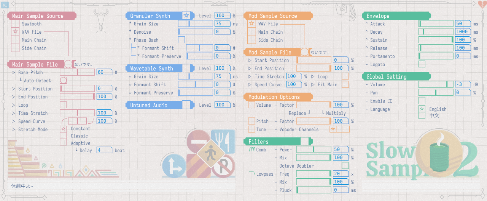

# SlowSampler2

[[English](README.md)]

SlowSampler是一个音频采样器VST3插件，旨在提供灵活的时间拉伸和变调选项，以处理不局限于常规乐器的音频样本。开发此插件的主要目标是音MAD和YTPMV类音频的制作，但插件也可用于音色设计或其它类型的音频创作。

本插件基于Pure Data图形语言，用户与开发者不需要重新编译插件，即可利用可视化的编辑器对插件的功能进行修改与定制。

## 功能简介

- 最多16复音的采样发声，既可作为乐器采样WAV波形文件，也可作为效果器处理DAW/宿主软件中的音频轨道
- 多种调音算法
  - 将任意音频转换为平稳的音调
  - 支持分别调节音调与共振峰
- 多种时间伸缩算法
  - 不受变调影响进行波形文件的变速，支持多种速度曲线
  - 可自动将波形文件的速度与MIDI音符的长度匹配
- 自带效果器
  - 用于音质增强的频域降噪和梳状滤波算法
  - 用于提取/复制音频特征的调制器与声码器

## 安装方法

请在本仓库的[Releases](https://github.com/chsh2/SlowSampler2/releases)页面下载压缩包，解压并复制`.vst3`文件夹到系统默认的VST3插件目录。

不同操作系统中的VST3默认目录可在以下页面查询：
https://steinbergmedia.github.io/vst3_dev_portal/pages/Technical+Documentation/Locations+Format/Plugin+Locations.html

## 使用方法

*此处提供插件的基本使用方法。对插件每个具体功能的详细介绍文档正在准备中。*

  
使用VST3插件

若安装成功，在DAW/宿主软件中可以看到两个新的VST3插件：

- **SlowSampler2**：此插件将被DAW识别为乐器。点击界面中的按钮读取一个WAV波形文件，即可将其作为音色进行演奏。
- **SlowSampler2FX**：此插件将被DAW识别为效果器。它包含乐器模式下的所有功能，此外可以选择主链或侧链的音频轨道作为采样源。请注意，插件仍然仅在收到MIDI输入时才会发声，在部分DAW中，需要手动设置来让效果器插件接收MIDI信号。

  
使用PlugData编辑器

[PlugData](https://plugdata.org/)是一个用来运行与编辑Pure Data程序的图形化环境，既可作为独立程序，又可作为音频插件使用。在PlugData中打开本插件提供的`plugdata.pd`文件，即可在PlugData内部使用本插件的功能。使用这种方法可以方便地对插件的功能进行调试与修改。

请注意，并不推荐使用原始的[Pure Data](https://puredata.info/)编辑器来运行本项目，因为本项目修改了部分代码、且引入了外部库。相关信息请查看以下关于编译的说明和[另一个GitHub仓库](https://github.com/chsh2/Camomile)（Camomile的分支）。

## 编译方法

若想自行编译此插件，可遵循以下步骤：

- 克隆[此Camomile分支](https://github.com/chsh2/Camomile)，按照其中的说明进行编译。
- 使用编译出的`.vst3`文件（在Linux下为`.so`文件）替换本插件中的对应文件。
  - 请参照Camomile的[Wiki页面](https://github.com/pierreguillot/Camomile/wiki/How-to-create-new-plugins)以了解将PureData程序与Camomile关联的细节。

使用此方法也可编译VST3以外的插件格式，如AU或LV2，但这些格式下SlowSampler的功能尚未经过测试。

## 参考与致谢

- 开发资源
    - [Pure Data](https://puredata.info/) by Miller Puckette and others
    - [libpd](https://github.com/libpd/libpd) by the Peter Brinkmann, Dan Wilcox and others
    - [PlugData](https://plugdata.org/) by Timothy Schoen and others
    - [Camomile](https://github.com/pierreguillot/Camomile) by Pierre Guillot and others
    - [ELSE](https://github.com/porres/pd-else) by Alexandre Torres Porres
    - [Cyclone](https://github.com/porres/pd-cyclone) by Krzysztof Czaja, Hans-Christoph Steiner, Fred Jan Kraan, Alexandre Porres, Derek Kwan, Matt Barber and others
- 美术资源
    - 部分图标来自于[Iconbuddy](https://iconbuddy.app/)
    - 字体: [Sarasa Gothic](https://github.com/be5invis/Sarasa-Gothic)
    - 字体: Calistoga